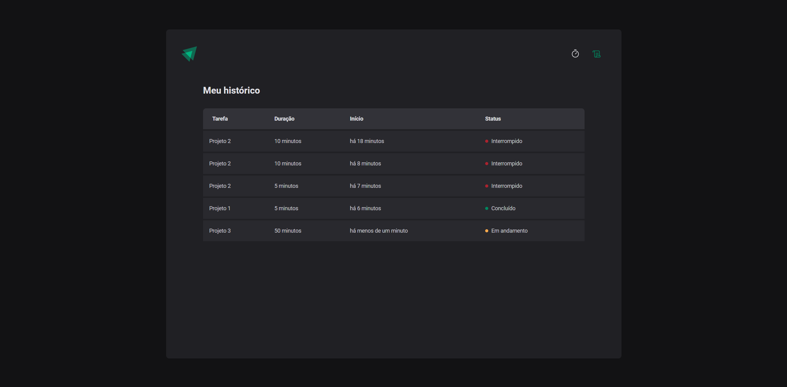

# Ignite Pomodoro
Este projeto é uma aplicação frontend desenvolvida com React, TypeScript e Vite, que implementa a técnica de Pomodoro para auxiliar na gestão de tempo e produtividade. O projeto foi desenvolvido com foco em estudo e aprendizado prático, como parte do curso oferecido pela Rocketseat.

---

---
