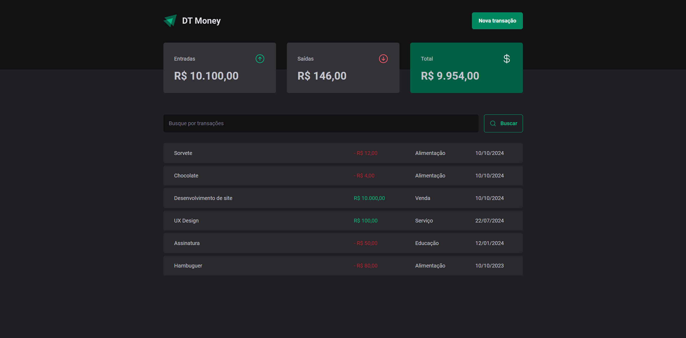
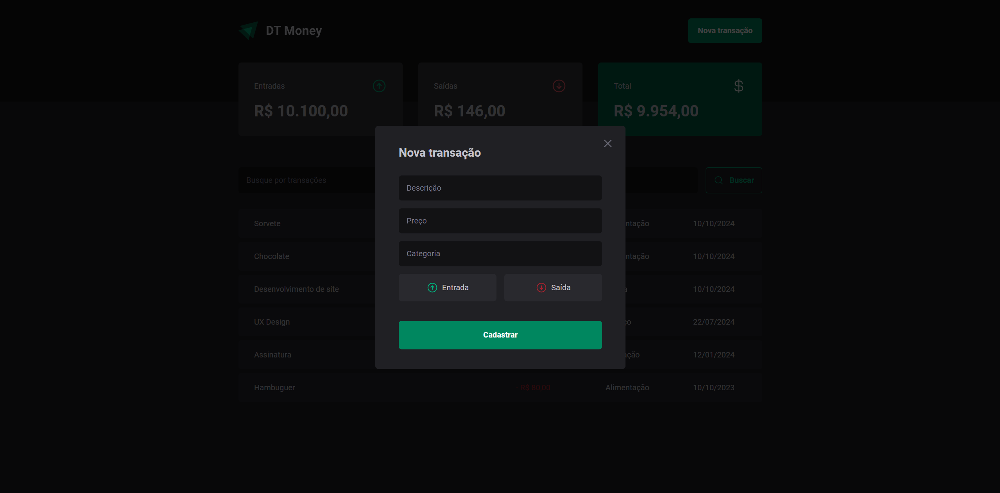
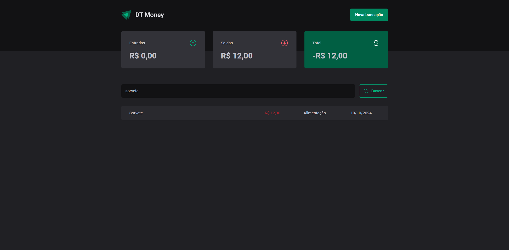

# Ignite: Controle Financeiro
Este projeto é uma aplicação frontend desenvolvida com React, TypeScript e Vite, que implementa um sistema de controle de gastos. O projeto foi desenvolvido com foco em estudo e aprendizado prático, como parte do curso oferecido pela Rocketseat.

---

---
